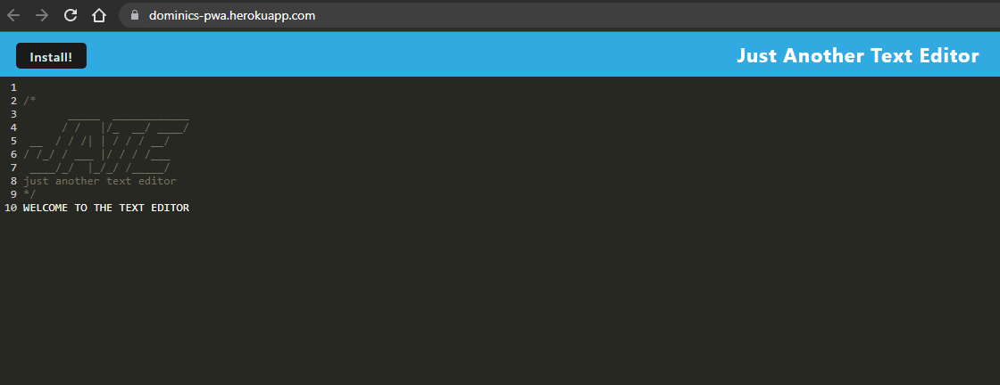

# PWA Text Editor
## Description

Check out the deployed application here! ---> https://dominics-pwa.herokuapp.com/

A progressive web application (PWA) text editor is a web-based tool that allows users to create, edit, and save text documents using a modern web browser. PWAs are designed to provide a fast, reliable, and seamless user experience, with features that make them feel and function like native applications.

In a PWA text editor, users can perform tasks such as formatting text, inserting images, and creating lists, using a variety of familiar tools and shortcuts. Because PWAs are designed to work offline, users can continue to work on their documents even when they are not connected to the internet, with changes syncing automatically once they regain connectivity.

PWAs are also highly responsive, adapting to different screen sizes and resolutions, and offering a mobile-friendly interface that is easy to navigate and use on a range of devices. They can be installed on the user's device, offering a "native app-like" experience without requiring a visit to an app store or the installation of any additional software.

Overall, a PWA text editor offers a powerful, flexible, and convenient way to create and edit text documents, with the added benefits of fast performance, offline capabilities, and a seamless user experience across devices.

# Preview

## Table of Contents
- [Features](#features)
- [Usage](#usage)
- [Author](#author)

## Features

Text features are elements within a text that are designed to help readers understand and navigate the content. Examples of text features include headings, subheadings, bullet points, bold or italicized text, captions, tables of contents, and indexes. These features are used to organize information, highlight important points, and guide readers through the text.

## Usage

Access the PWA text editor: You can access the PWA text editor by visiting the URL in your web browser. You may also be able to install the PWA on your device, depending on the specific implementation.

Create or open a document: Once you are in the PWA text editor, you can create a new document or open an existing one. You may be prompted to sign in or create an account to save your work.

Use the text editing tools: The PWA text editor will likely have a toolbar or menu with various text editing tools, such as font selection, font size, bold, italic, underline, alignment, and more. Use these tools to format your text as desired.

Add other text features: In addition to formatting text, you can also add other text features such as headings, subheadings, bullet points, and numbered lists. These can help organize your content and make it easier to read.

Save your work: Be sure to save your work regularly to avoid losing any changes. The PWA text editor may have an autosave feature, but it's always a good idea to manually save your work as well.

Sync your work: If you are working offline, your changes will be saved locally. Once you regain internet connectivity, your changes will sync automatically to the server.

## Author

- Dominic Paulazzo ([wevexOP](https://github.com/wevexOP))
